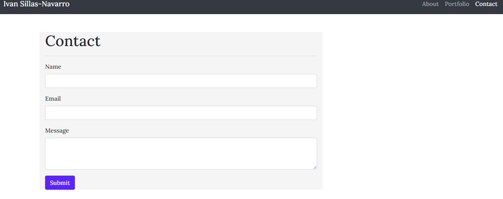

# Responsive-Portfolio
-OVERVIEW-
The focus of this project was centered around creating a professional portfolio using Boostrap grids and CSS. Three files were created: About me file, contact file and portfolio file, linked together. 

# AboutMe
This file is completely designed using BootStrap grids: navbar, main, and footer. This file's content proliferates who I am. 

# Portfolio
Th portfolio file shares the projects to display. As projects get completed, this file gets updated. Snapshots are provided of the completed projects with a proper description.

# Contact
This last file was created for networking this way future clients, or people in general have away to leave their contact information with a message. 

